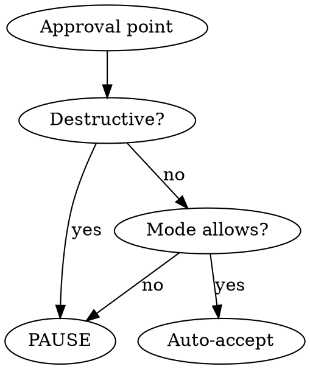

# Hands-Free

Auto-accept recommended options from any skill without pausing. Works with superpowers, custom skills, or any workflow with approval points.

## Commands

```
/hands-free              # full mode (recommended)
/hands-free full         # same — auto-accept all non-destructive points
/hands-free partial      # auto-accept design only, pause at execution
/hands-free off          # disable
/hands-free auto-commit on    # auto-commit changes at natural milestones
/hands-free auto-commit off   # disable auto-commit (default)
/hands-free learning <h/m/l>  # set learning sensitivity
/hands-free recommend    # show recommended settings based on usage
/hands-free log          # show session decisions
/hands-free status       # show current mode + learning level
```

## Recommended Setup

> `/hands-free full` + `/hands-free learning high`
>
> Best for experienced users who trust the defaults and want maximum speed. Auto-accepts everything non-destructive, learns your preferences after a single choice.

## Mode Behavior

| Approval Type | full | partial | off |
|---|---|---|---|
| Brainstorming approaches | auto | auto | ask |
| Design approval | auto | auto | ask |
| Execution method | auto | **ask** | ask |
| Batch checkpoints | auto | **ask** | ask |
| Phase transitions | auto | auto | ask |
| Destructive actions | **ask** | **ask** | **ask** |
| Git commit (auto-commit on) | auto | auto | ask |
| Git push | **ask** | **ask** | **ask** |

Mode and learning can be combined: `/hands-free full` then `/hands-free learning high`. **Learning thresholds govern when preferences are recorded and applied; mode governs what gets auto-accepted when no preference exists.** They are independent axes.

## Core Rule

When active, MUST auto-proceed with the recommended option. Do NOT pause, present options, or wait. **Announce, don't ask:** "Going with approach 2 (recommended) — [reason]" and continue.

Applies to **any skill** — not just superpowers:
- Options with recommendation → pick it
- Approval to continue → approve
- Design/plan review → approve
- Checkpoint pause → continue

### When You Must Pause and Ask

In partial mode or at hard stops, when presenting options to the user via `AskUserQuestion`, mark the recommended option with a `markdown` preview panel — do NOT add "(Recommended)" to the label:

```
{
  "label": "Subagent-Driven",
  "description": "Dispatch fresh subagent per task with two-stage review",
  "markdown": "## Recommended\n\nBest for staying in this session with fast iteration.\n\n**Pros:** No context switch, review checkpoints automatic\n**Con:** More subagent invocations"
}
```

The `markdown` field is only visible when the option is focused — it surfaces the rationale without cluttering the label. Use it on the recommended option only.

### Superpowers-Specific Approval Points

| Skill | Approval Point | Auto Action |
|-------|---------------|-------------|
| brainstorming | 2-3 approach options | Pick recommended approach |
| brainstorming | Design section approval | Approve, continue to next |
| brainstorming | Final design approval | Approve, proceed to writing-plans |
| writing-plans | Execution method choice | Pick recommended method (full only) |
| executing-plans | Batch checkpoint | Continue to next batch (full only) |
| systematic-debugging | Phase transitions | Proceed through all phases |

## Auto-Commit

When enabled (`/hands-free auto-commit on`), automatically commit changes at natural milestones without asking. Off by default.

### When to Auto-Commit

- After completing a discrete task (feature, bugfix, refactor)
- After a plan step or batch is finished
- After tests pass for a completed change
- After meaningful file edits that form a logical unit

### How It Works

1. Stage only the relevant changed files (`git add <specific files>`) — never `git add -A` or `git add .`
2. Write a concise commit message following the repo's existing commit style
3. Announce: "Auto-committed: `<short message>`"
4. Log it in the session log

### Safety Rules

- **Never commit** `.env`, credentials, secrets, or large binaries
- **Never amend** existing commits — always create new ones
- **Never skip** pre-commit hooks (`--no-verify` is forbidden)
- If a pre-commit hook fails, announce the failure and pause for user input
- `git push` is still a **HARD STOP** — auto-commit is local only

### Session Log Entry

```
[auto-commit] feat: add validation to user input form (3 files)
[auto-commit] fix: handle null response in API client (1 file)
```

## Learning

Preferences stored in `~/.claude/skills/hands-free/preferences.md`. Records choices whether hands-free is on or off.

### When to Record

Record a preference whenever the user **manually chooses** an option — whether hands-free is on or off:

- User picks a non-recommended approach → record it
- User consistently picks the same option → record it
- User overrides an auto-accept decision → record the override
- User approves or rejects a destructive action → record it

### Sensitivity

| | high | medium (default) | low |
|---|---|---|---|
| Track only | — | 1-2x | 1-4x |
| Auto-apply + announce | — | 3-4x | 5-6x |
| Auto-apply silently | 1x+ | 5x+ | 7x+ |

### Decision Priority

1. High-confidence preference → use silently
2. Medium-confidence preference → use + announce source
3. No preference → use recommended + announce

### Recording Format

```markdown
## Learned Rules
- finishing-branch → "Push and create PR" (5x, high)
- writing-plans → "subagent-driven" (3x, medium)

## Observations
- 2026-02-26: brainstorming → chose simplest over recommended (1x)
```

## `/hands-free recommend`

When invoked, analyze `preferences.md` and current usage to suggest optimal settings:

```
Hands-Free Recommendations:
  Mode: full (you rarely override auto-accepted decisions)
  Learning: high (you're consistent — 90% of choices match first occurrence)
  Suggestion: Consider adding git push to feature branches as auto-accept
             (you've approved 8/8 feature branch pushes, rejected 0)
```

**Smart suggestions include:**
- Mode upgrade/downgrade based on override frequency
- Learning level based on choice consistency
- Promoting hard-stop actions to auto-accept if user always approves them (requires explicit user confirmation to add)
- Demoting auto-accept actions to hard-stop if user frequently overrides

## Session Log

Tracked in memory. View with `/hands-free log`:

```
Hands-Free Session Log (full, learning: high)
  [brainstorming] approach 2 (recommended)
  [brainstorming] design approved (3 sections)
  [writing-plans] subagent-driven (your preference)
  [executing-plans] batches 1-3 auto-continued
  [finishing-branch] PAUSED — git push → user approved
```

## Ralph Loop Integration

Hands-free is designed to work with ralph-loop (`/ralph-loop`) and superpowers together. When a ralph-loop is active (`.claude/.ralph-loop.local.md` exists), hands-free enters **loop-aware mode** automatically.

### Detecting Loop Mode

Check for `.claude/.ralph-loop.local.md` at the start of each iteration. If present, hands-free is loop-aware.

### Loop-Aware Behavior

**Skip repeated brainstorming.** If the current iteration's task matches the previous iteration (same prompt), do NOT re-brainstorm from scratch. Instead:
- Iteration 1: Full brainstorming → pick recommended → design → plan
- Iteration 2+: Read previous work from files/git → continue where left off or improve

**Auto-detect iteration phase.** Each iteration, assess what state the work is in:
1. No prior work → start fresh with superpowers brainstorming
2. Partial implementation → continue executing the existing plan
3. Tests failing → enter systematic-debugging
4. Tests passing, work incomplete → continue to next plan step
5. All work complete → output the completion promise

**Iteration-aware auto-commits.** When auto-commit is on, tag commits with the iteration number:
```
[ralph #3] feat: add input validation to user form
[ralph #3] fix: handle edge case in date parser
[ralph #4] test: add missing integration tests
```

Read the iteration count from `.claude/.ralph-loop.local.md` state file.

### Superpowers Skill Routing in Loop Mode

| Iteration State | Superpowers Skill | Hands-Free Action |
|---|---|---|
| No prior work | brainstorming → writing-plans | Auto-accept all, full flow |
| Plan exists, not started | executing-plans | Auto-continue batches |
| Plan in progress | executing-plans | Resume from last batch |
| Tests failing | systematic-debugging | Auto-proceed through phases |
| Implementation done | verification-before-completion | Auto-verify |
| All complete | finishing-a-development-branch | PAUSE for push/merge |

### Quick Start

```
/hands-free full
/hands-free auto-commit on
/hands-free learning high
/ralph-loop "Build feature X. Output <promise>DONE</promise> when all tests pass." --completion-promise "DONE" --max-iterations 15
```

Each iteration flows automatically:
1. Hands-free detects loop state
2. Assesses current progress from files/git
3. Routes to the right superpowers skill
4. Auto-accepts all non-destructive decisions
5. Auto-commits at milestones with `[ralph #N]` prefix
6. Exits iteration → ralph-loop feeds prompt again
7. Repeats until `<promise>DONE</promise>`

### What Hands-Free Does NOT Do in Loop Mode

- Does NOT auto-accept `git push` — still a hard stop
- Does NOT skip the completion promise check — ralph-loop controls termination
- Does NOT override ralph-loop's `--max-iterations` limit
- Does NOT re-brainstorm if a design already exists from a prior iteration

## HARD STOP — Always Pause

Applies in ALL modes. Never auto-accept:

**Git operations**
- `git push` / `git merge` / `git reset --hard` / force operations
- Amending published commits
- "Discard this work" in finishing-branch
- Deleting branches

**Destructive file/system operations**
- `rm -rf` or bulk file/directory deletion
- Dropping database tables or destructive migrations
- Killing processes
- Removing or downgrading packages/dependencies

**Shared/remote state**
- Sending messages (Slack, email, GitHub comments)
- Creating, closing, or commenting on PRs or issues
- Modifying CI/CD pipelines
- Modifying shared infrastructure or permissions
- Any other action visible to others or affecting external systems



**Red flags — if you think these, STOP:**

| Thought | Reality |
|---|---|
| "Just a push to my branch" | All pushes need approval |
| "Merge to main is obvious" | All merges need approval |
| "Discarding saves time" | Destructive — ask first |
| "Force push will fix it" | Irreversible — ask first |
