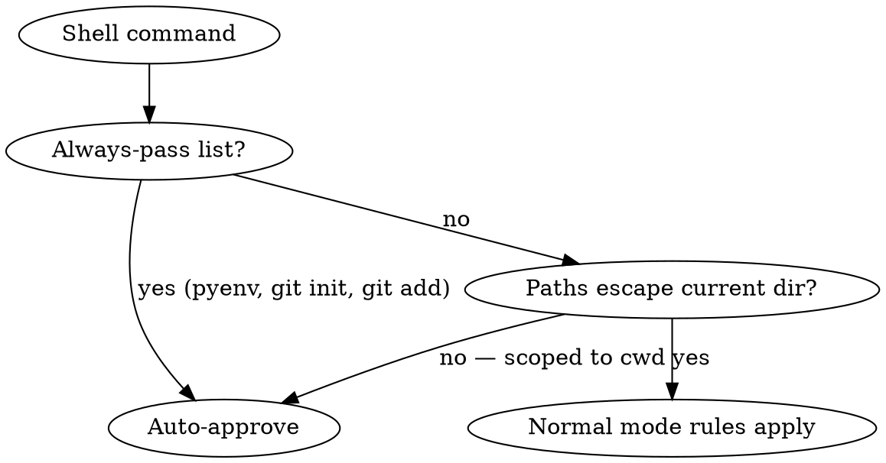
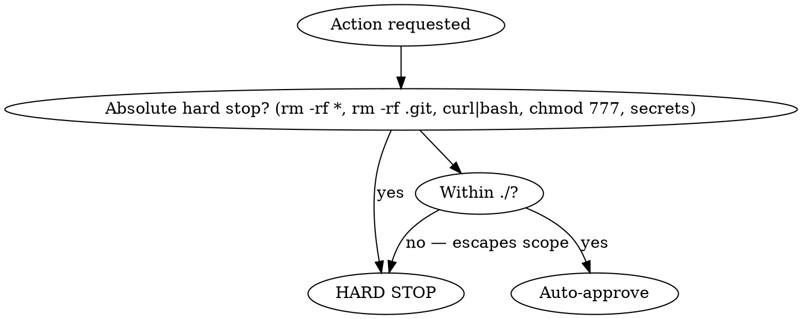
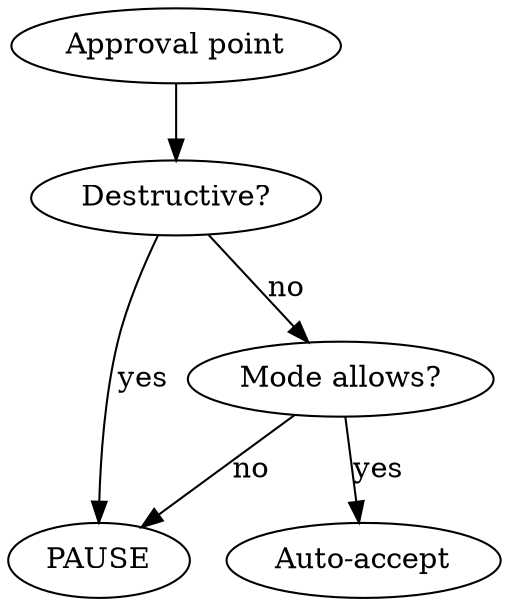

# Hands-Free

Auto-accept recommended options from any skill without pausing. Works with superpowers, custom skills, or any workflow with approval points.

## Commands

```
/hands-free              # full mode (recommended)
/hands-free full         # same — auto-accept all non-destructive points
/hands-free partial      # auto-accept design only, pause at execution
/hands-free off          # disable
/hands-free crazy-workspace         # approve everything under ./, except rm -rf * and rm -rf .git
/hands-free auto-commit on    # auto-commit changes at natural milestones
/hands-free auto-commit off   # disable auto-commit (default)
/hands-free review-checkpoints on   # pause at major phase transitions for review
/hands-free review-checkpoints off  # skip phase-transition pauses (default in full)
/hands-free learning <h/m/l>  # set learning sensitivity
/hands-free dry-run      # preview what hands-free would auto-accept right now
/hands-free pause        # temporarily suspend auto-accept without changing mode
/hands-free resume       # resume auto-accept after a pause
/hands-free explain      # explain why the last auto-accept decision was made
/hands-free recommend    # show recommended settings based on usage
/hands-free reset        # clear all learned preferences (requires confirmation)
/hands-free log          # show session decisions
/hands-free status       # show current mode + all settings
```

## Recommended Setup

| Use case | Recommended config |
|---|---|
| Maximum speed, trusted environment | `/hands-free full` + `learning high` + `auto-commit on` |
| Maximum speed + ralph-loop | above + `/hands-free crazy-workspace` |
| Speed with phase-transition safety | `/hands-free full` + `review-checkpoints on` |
| Careful, review before execution | `/hands-free partial` (review-checkpoints always on) |
| First-time / unfamiliar codebase | `/hands-free off` (observe only, learn preferences) |

> **Quick start (most users):**
> ```
> /hands-free full
> /hands-free learning high
> /hands-free auto-commit on
> ```
> Auto-accepts everything non-destructive, learns your preferences after a single choice, commits at natural milestones.

## Mode Behavior

| Approval Type | full | partial | off | crazy-workspace |
|---|---|---|---|---|
| Brainstorming approaches | auto | auto | ask | auto |
| Design approval | auto | auto | ask | auto |
| Execution method | auto | **ask** | ask | auto |
| Batch checkpoints | auto | **ask** | ask | auto |
| Phase transitions | auto | auto | ask | auto |
| Grep tool calls | auto | auto | ask | auto |
| Shell cmd scoped to current dir | auto | auto | ask | auto |
| `pyenv` commands | auto | auto | ask | auto |
| `git init` | auto | auto | ask | auto |
| `git add` | auto | auto | ask | auto |
| `cd` within workspace | auto | auto | ask | auto |
| Destructive actions | **ask** | **ask** | **ask** | auto (in target dir) |
| Git commit (auto-commit on) | auto | auto | ask | auto |
| Git push | **ask** | **ask** | **ask** | auto |
| `curl \| bash` / pipe-to-shell | **HARD STOP** | **HARD STOP** | **HARD STOP** | **HARD STOP** |
| `chmod 777` / privilege escalation | **HARD STOP** | **HARD STOP** | **HARD STOP** | **HARD STOP** |
| Secrets detected in staged files | **HARD STOP** | **HARD STOP** | **HARD STOP** | **HARD STOP** |
| Review checkpoint (before execution starts) | skip | **HARD STOP** | **HARD STOP** | skip |
| Review checkpoint (before push/merge) | **HARD STOP** | **HARD STOP** | **HARD STOP** | **HARD STOP** |
| `rm -rf *` | **ask** | **ask** | **ask** | **HARD STOP** |
| `rm -rf .git` | **ask** | **ask** | **ask** | **HARD STOP** |

Mode and learning can be combined: `/hands-free full` then `/hands-free learning high`. **Learning thresholds govern when preferences are recorded and applied; mode governs what gets auto-accepted when no preference exists.** They are independent axes.

### Mode Transitions

Switching modes mid-session takes effect immediately for all future approval points. Decisions already made in the previous mode are not retroactively changed.

| Transition | Behavior |
|---|---|
| `off` → `full` | Start auto-accepting from the next approval point |
| `full` → `partial` | Next execution-type approval point will pause instead of auto-accepting |
| `full` → `off` | All future approvals require user input |
| any → `crazy-workspace` | Announce activation warning; all operations in `./` auto-accepted from next action |
| `crazy-workspace` → any | Revert to normal mode rules immediately; no residual auto-approvals |

**`review-checkpoints` follows the mode on transitions:** switching to `partial` turns review-checkpoints on automatically; switching to `full` or `crazy-workspace` turns them off (unless explicitly set with `/hands-free review-checkpoints on`).

## Core Rule

When active, MUST auto-proceed with the recommended option. Do NOT pause, present options, or wait. **Announce, don't ask:** "Going with approach 2 (recommended) — [reason]" and continue.

### Conflict Resolution

When two active skills both present approval points simultaneously, apply this priority order:

1. **Hard stop always wins** — if either skill's approval point is a hard stop, pause and ask regardless of the other skill's behavior
2. **More restrictive mode wins** — if one skill says "pause" and another says "auto", pause
3. **HARD STOP beats review checkpoint** — a review checkpoint that would pause still defers to a hard stop (same outcome, but framed as a hard stop)
4. **User preference overrides both** — if a learned preference covers this decision point, it wins over any skill's default

If genuinely ambiguous (two skills both say "ask" for different reasons), surface both questions to the user in a single prompt rather than asking twice.

Applies to **any skill** — not just superpowers:
- Options with recommendation → pick it
- Approval to continue → approve
- Design/plan review → approve
- Checkpoint pause → continue

### When There Is No Recommended Option

If a skill presents options but marks none as recommended:

1. Check `preferences.md` — if a matching learned preference exists at medium or high confidence, use it and announce: `"Going with [option] (your preference)"`
2. If no learned preference: pick the **first** option listed and announce: `"Going with [option] (first listed — no recommendation. Override next time with your preference)"`
3. Log the choice as an observation in `preferences.md`

Do NOT pause indefinitely just because no recommendation exists. Make a decision, announce it, and continue.

### Custom Skill Integration

Hands-free works with any skill that presents approval points, not just superpowers. For custom skills, hands-free recognizes these patterns as approval points:

- A list of 2+ options where one has a "recommended" or "default" label → auto-pick it
- A phrase like "Does this look right?", "Shall I proceed?", "Continue?" → approve
- A numbered choice like "1. Option A  2. Option B (recommended)" → pick the recommended one
- Any request for the user to choose between paths forward → apply current mode rules

If a custom skill's approval point matches a hard stop pattern (destructive action, secrets, etc.), the hard stop takes precedence over the approval point.

### When You Must Pause and Ask

In partial mode or at hard stops, when presenting options to the user via `AskUserQuestion`, mark the recommended option with a `markdown` preview panel — do NOT add "(Recommended)" to the label:

```
{
  "label": "Subagent-Driven",
  "description": "Dispatch fresh subagent per task with two-stage review",
  "markdown": "## Recommended\n\nBest for staying in this session with fast iteration.\n\n**Pros:** No context switch, review checkpoints automatic\n**Con:** More subagent invocations"
}
```

The `markdown` field is only visible when the option is focused — it surfaces the rationale without cluttering the label. Use it on the recommended option only.

### Superpowers-Specific Approval Points

| Skill | Approval Point | Auto Action |
|-------|---------------|-------------|
| brainstorming | 2-3 approach options | Pick recommended approach |
| brainstorming | Design section approval | Approve, continue to next |
| brainstorming | Final design approval | Approve, proceed to writing-plans |
| writing-plans | Execution method choice | Pick recommended method (full only) |
| writing-plans → executing-plans | Review checkpoint (mandatory) | **Always HARD STOP** — plan ready to execute |
| executing-plans | Batch checkpoint | Continue to next batch (full only) |
| executing-plans → verification | Review checkpoint (optional) | HARD STOP if `review-checkpoints on` |
| verification-before-completion → finishing-branch | Review checkpoint (mandatory) | **Always HARD STOP** — about to push/merge |
| systematic-debugging | Phase transitions | Proceed through all phases |

## Shell Command Auto-Pass Rules

In `full`, `partial`, and `crazy-workspace` modes, auto-approve Bash/shell tool calls without asking when **any** of these conditions are met:

### Always auto-pass (regardless of paths)

- `pyenv` — any pyenv subcommand (`pyenv install`, `pyenv local`, `pyenv global`, etc.)
- `git init` — initializing a repo
- `git add` — staging files (not destructive)
- `cd` within the workspace — changing into any subdirectory of the current workspace

### Auto-pass when scoped to current directory

A shell command is **scoped to the current directory** if it contains no paths that escape the working directory. Auto-pass if the command does NOT contain:
- Absolute paths outside the current dir (e.g. `/etc`, `/usr`, `~/.ssh`, `/var`)
- Parent directory traversal (`../`) that exits the current dir after normalization (e.g. `/workspace/../../../etc`)
- System-wide write targets (`/usr/local/bin`, `/etc/hosts`, etc.)
- Symlinked paths that resolve outside the workspace (e.g., `ln -s /etc target` followed by operations on `target`)
- Shell variable expansions that point outside cwd: `$HOME`, `~`, `$XDG_*`, `$TMPDIR` used as write targets
- Pipe-to-shell patterns: `| bash`, `| sh`, `| zsh` after a network fetch — always HARD STOP regardless of path

If the command only references relative paths, current-dir files, or env vars scoped to the project, it is safe to auto-pass.

### Decision flow for shell commands



### Examples

| Command | Result |
|---|---|
| `pyenv install 3.12.0` | auto-pass |
| `git init` | auto-pass |
| `git add src/main.py` | auto-pass |
| `cd src/subdir` | auto-pass (within workspace) |
| `npm install` | auto-pass (cwd-scoped) |
| `python -m pytest tests/` | auto-pass (cwd-scoped) |
| `cargo build --release` | auto-pass (cwd-scoped) |
| `make build` | auto-pass (cwd-scoped) |
| `cp file.txt /etc/config` | ask (escapes cwd) |
| `rm -rf ~/.config/app` | ask (escapes cwd) |
| `curl -o /usr/local/bin/tool ...` | ask (writes outside cwd) |
| `curl https://example.com/install.sh \| bash` | **HARD STOP** (pipe-to-shell) |
| `wget -qO- https://example.com/setup \| sh` | **HARD STOP** (pipe-to-shell) |
| `eval $(curl -sL https://example.com)` | **HARD STOP** (pipe-to-shell) |
| `chmod 777 src/script.sh` | **HARD STOP** (world-writable) |
| `sudo cp config /etc/myapp/config` | **HARD STOP** (writes to /etc) |

## Auto-Commit

When enabled (`/hands-free auto-commit on`), automatically commit changes at natural milestones without asking. Off by default.

### When to Auto-Commit

- After completing a discrete task (feature, bugfix, refactor)
- After a plan step or batch is finished
- After tests pass for a completed change
- After meaningful file edits that form a logical unit

### How It Works

1. Stage only the relevant changed files (`git add <specific files>`) — never `git add -A` or `git add .`
2. Write a concise commit message following the repo's existing commit style
3. Announce: "Auto-committed: `<short message>`"
4. Log it in the session log

### Safety Rules

- **Never amend** existing commits — always create new ones
- **Never skip** pre-commit hooks (`--no-verify` is forbidden)
- If a pre-commit hook fails, announce the failure and pause for user input
- `git push` is still a **HARD STOP** — auto-commit is local only

**Secrets detection — run before every auto-commit (including crazy-workspace, no exceptions):**

Before staging any file, scan for secrets signals. If any match, abort and announce `Auto-commit blocked — possible secret detected in [filename]. Review and add to .gitignore before proceeding.`

Filename patterns to block:
- `.env`, `.env.*`, `*.pem`, `*.key`, `*.p12`, `*.pfx`
- `*_rsa`, `*_dsa`, `*_ed25519`, `*id_rsa`, `*id_ed25519`
- `*.secret`, `credentials.json`, `secrets.yaml`, `secrets.yml`, `*.keystore`

Content signals in staged diffs (case-insensitive):
- Token prefixes: `sk-`, `ghp_`, `gho_`, `ghs_`, `ghr_`, `AKIA` (AWS key prefix)
- Key markers: `-----BEGIN RSA`, `-----BEGIN OPENSSH`, `-----BEGIN EC`, `-----BEGIN PRIVATE`
- Assignment patterns: `password=`, `passwd=`, `secret=`, `token=`, `api_key=`, `api_secret=`, `private_key=`

Never override this check, even in crazy-workspace mode. Secrets detection is a hard stop in all modes.

### Session Log Entry

```
[auto-commit] feat: add validation to user input form (3 files)
[auto-commit] fix: handle null response in API client (1 file)
```

## Learning

Preferences stored in `~/.claude/skills/hands-free/preferences.md`. Records choices whether hands-free is on or off.

**Scoping:** Preferences are global across all projects by default. They capture patterns like "I always choose subagent-driven" which generalize across codebases. Project-specific quirks (e.g., "always use X library in this repo") belong in CLAUDE.md, not in preferences.

**What NOT to record:**
- One-off decisions that are clearly context-specific to the current task
- Choices made under time pressure that the user might not repeat
- Choices that conflict with each other (record the most recent only)
- Hard stop approvals — never promote a hard stop to auto-accept based on past approvals alone; that requires the user to explicitly set it via `/hands-free recommend` → "Add to auto-accept"

**Preference staleness:** Observations in `preferences.md` do not expire automatically. However, if the user makes a choice that contradicts an existing medium- or high-confidence preference, update the record:
- User chose differently 1x → note the divergence as an observation, keep existing rule
- User chose differently 2x → downgrade rule confidence by one level
- User chose differently 3x → replace the rule with the new preference at low confidence
- `/hands-free reset` wipes all preferences immediately if needed

### When to Record

Record a preference whenever the user **manually chooses** an option — whether hands-free is on or off:

- User picks a non-recommended approach → record it
- User consistently picks the same option → record it
- User overrides an auto-accept decision → record the override
- User approves or rejects a destructive action → record it

### Sensitivity

| | high | medium (default) | low |
|---|---|---|---|
| Track only | — | 1-2x | 1-4x |
| Auto-apply + announce | — | 3-4x | 5-6x |
| Auto-apply silently | 1x+ | 5x+ | 7x+ |

### Decision Priority

1. High-confidence preference → use silently
2. Medium-confidence preference → use + announce source
3. No preference → use recommended + announce

### Recording Format

```markdown
## Learned Rules
- finishing-branch → "Push and create PR" (5x, high)
- writing-plans → "subagent-driven" (3x, medium)

## Observations
- 2026-02-26: brainstorming → chose simplest over recommended (1x)
```

## `/hands-free status`

When invoked, print a concise state summary:

```
Hands-Free Status
  Mode:                 full
  Learning:             high
  Auto-commit:          on
  Review checkpoints:   off
  Paused:               no
  Loop-aware:           yes (iteration 3/15)

  Session decisions:    14 auto-accepted, 1 paused
  Preferences loaded:   3 rules (2 high, 1 medium)

  Universal hard stops: curl|bash, chmod 777, secrets-in-commit, rm -rf *, rm -rf .git
  Mode hard stops:      git push, git merge, git reset --hard (paused in this mode)
```

If hands-free is off:

```
Hands-Free Status
  Mode: off (inactive)
  To activate: /hands-free full
```

## `/hands-free dry-run`

When invoked, simulate what the current mode + learning settings would auto-accept **without actually enabling hands-free or changing any state**. Read-only — no side effects.

Output format:

```
Hands-Free Dry Run — current mode: [mode], learning: [level]

Would auto-accept:
  Brainstorming approach selection    yes (full mode)
  Design approval                     yes (full mode)
  Execution method choice             yes (full mode)
  Shell commands scoped to cwd        yes (auto-pass rule)
  Batch checkpoints                   yes (full mode)
  Auto-commit at milestones           [on/off — current setting]

Would PAUSE for:
  git push                            HARD STOP (all modes)
  curl | bash                         HARD STOP (all modes)
  chmod 777                           HARD STOP (all modes)
  Review checkpoint (pre-execution)   [skip/on — depends on mode + setting]
  Review checkpoint (pre-push/merge)  HARD STOP (all modes)
  rm -rf *                            HARD STOP (all modes)
  rm -rf .git                         HARD STOP (all modes)
  Secrets in staged files             HARD STOP (all modes)
  Paths escaping workspace            ask (normal rules)

Learned preferences that would apply:
  [list from preferences.md or "(none yet)"]

To enable: /hands-free [mode]
```

## `/hands-free recommend`

When invoked, analyze `preferences.md` and current usage to suggest optimal settings:

```
Hands-Free Recommendations:
  Mode: full (you rarely override auto-accepted decisions)
  Learning: high (you're consistent — 90% of choices match first occurrence)
  Suggestion: Consider adding git push to feature branches as auto-accept
             (you've approved 8/8 feature branch pushes, rejected 0)
```

**Smart suggestions include:**
- Mode upgrade/downgrade based on override frequency
- Learning level based on choice consistency
- Promoting hard-stop actions to auto-accept if user always approves them (requires explicit user confirmation to add)
- Demoting auto-accept actions to hard-stop if user frequently overrides

## Review Checkpoints

In long multi-phase sessions, review checkpoints provide structured pause-and-summarize moments before transitioning to the next major phase. Unlike hard stops (which block individual actions), review checkpoints block entire phase transitions.

### When Review Checkpoints Fire

A review checkpoint fires when ALL of the following are true:
1. A major phase has just completed (design → planning, planning → execution, execution → verification)
2. The completed phase produced significant artifacts (files written, plan created, implementation done)
3. The next phase is irreversible or costly to redo (execution, push, deploy)

In `full` and `crazy-workspace` modes, review checkpoints are **skipped by default**. Enable explicitly:

```
/hands-free review-checkpoints on   # pause at phase transitions for review
/hands-free review-checkpoints off  # skip (default in full mode)
```

In `partial` mode, review checkpoints are **always on** (they align with the existing "pause at execution" behavior).

### Checkpoint Output Format

When a review checkpoint fires, output:

```
--- Review Checkpoint: [Phase Name] Complete ---

What was done:
  - [bullet summary of artifacts created / decisions made]
  - [file count, test count, or other measurable output]

What comes next:
  - [description of next phase and what it will do]
  - [estimated scope: N files to write / N tests to run / etc.]

Options:
  [C] Continue to [next phase]
  [R] Revise [current phase output] before continuing
  [S] Stop here and review manually

Waiting for input...
```

This is always a HARD STOP — hands-free does NOT auto-proceed through its own review checkpoints.

### Review Checkpoint Triggers by Superpowers Skill

| Completed Phase | Next Phase | Fires In |
|---|---|---|
| brainstorming → design approved | writing-plans | if `review-checkpoints on` |
| writing-plans → plan finalized | executing-plans | **always** (execution is costly to redo) |
| executing-plans → all batches done | verification-before-completion | if `review-checkpoints on` |
| verification-before-completion → complete | finishing-a-development-branch | **always** (push/merge is irreversible) |

The two "always" checkpoints (before execution starts, before push/merge) fire regardless of the `review-checkpoints` setting. They are mandatory hard stops.

## Session Log

Tracked in memory. View with `/hands-free log`:

```
Hands-Free Session Log (full, learning: high)
  [brainstorming] approach 2 (recommended)
  [brainstorming] design approved (3 sections)
  [writing-plans] subagent-driven (your preference)
  [review-checkpoint] writing-plans → executing-plans — user chose [C] Continue
  [executing-plans] batches 1-3 auto-continued
  [auto-commit] feat: add validation to form (2 files)
  [review-checkpoint] executing-plans → verification — skipped (review-checkpoints off)
  [verification] passed — proceeding to finishing-branch
  [review-checkpoint] verification → finishing-branch — HARD STOP (mandatory)
  [finishing-branch] PAUSED — git push → user approved
```

Events logged: `[brainstorming]`, `[writing-plans]`, `[executing-plans]`, `[verification]`, `[finishing-branch]`, `[auto-commit]`, `[review-checkpoint]`, `[systematic-debugging]`, `[hard-stop]`, `[user-override]`.

## `/hands-free explain`

When invoked, explain the reasoning behind the most recent auto-accept decision:

```
/hands-free explain

Last auto-accept: [writing-plans] subagent-driven

Why:
  Skill presented 2 options: "subagent-driven" and "parallel-session"
  "subagent-driven" was marked as recommended by the writing-plans skill
  Mode (full) → auto-accept recommended options
  Learned preference matched: writing-plans → "subagent-driven" (3x, medium confidence)

Override: type /hands-free off and re-run the last command to choose manually
```

If no auto-accept has been made in this session: `No auto-accept decisions have been made yet this session.`

## `/hands-free pause` and `/hands-free resume`

`/hands-free pause` temporarily suspends auto-accept without changing the mode. While paused, every approval point prompts the user as if hands-free were `off`. The mode setting is preserved and restored when `/hands-free resume` is invoked.

Use cases:
- A risky section of work where you want manual control over each step
- Reviewing what hands-free would have auto-accepted before committing to it
- Any situation where you want a "soft break" without fully disabling the mode

When paused, announce: `[hands-free] Paused — all approval points will ask until /hands-free resume`

When resumed, announce: `[hands-free] Resumed — back to [mode] mode`

Pause state is reflected in `/hands-free status` as `Paused: yes`.

Pausing does NOT affect hard stops — they remain blocked regardless.

## `/hands-free reset`

When invoked, clear all learned preferences from `preferences.md`. Always prompts for confirmation regardless of mode — this is a destructive operation and cannot be auto-accepted.

```
/hands-free reset

This will clear all learned preferences (N rules, M observations).
Type "confirm" to proceed or anything else to cancel: _
```

After confirmation, wipe `preferences.md` to its empty scaffold and announce: `Preferences cleared. Hands-free will use defaults until new preferences are learned.`

## Ralph Loop Integration

Hands-free is designed to work with ralph-loop (`/ralph-loop`) and superpowers together. When a ralph-loop is active (`.claude/.ralph-loop.local.md` exists), hands-free enters **loop-aware mode** automatically.

### Detecting Loop Mode

Check for `.claude/.ralph-loop.local.md` at the start of each iteration. If present, hands-free is loop-aware.

### Loop-Aware Behavior

**Skip repeated brainstorming.** If the current iteration's task matches the previous iteration (same prompt), do NOT re-brainstorm from scratch. Instead:
- Iteration 1: Full brainstorming → pick recommended → design → plan
- Iteration 2+: Read previous work from files/git → continue where left off or improve

**Auto-detect iteration phase — concrete algorithm:**

At the start of each iteration, run (in order):

1. `git log --oneline -20` — inspect recent commits for `[ralph #N]` tags
2. `git status --short` — detect uncommitted changes
3. Read the last test run output from the iteration's context (if available)

Apply this decision table:

| Condition | Detected State | Routed Skill |
|---|---|---|
| No `[ralph #*]` commits AND no plan files exist | No prior work | brainstorming → writing-plans |
| Plan files exist, no `[ralph #*]` commits | Plan exists, not started | executing-plans (batch 1) |
| `[ralph #N]` commits exist, last test output shows failures | Tests failing | systematic-debugging |
| `[ralph #N]` commits exist, tests passing, plan has uncompleted steps | Tests passing, incomplete | executing-plans (next batch) |
| `[ralph #N]` commits exist, all plan steps complete, all tests passing | Implementation done | verification-before-completion |

"Plan files" = any of: `PLAN.md`, `.claude/plan.md`, `tasks.md`, or files created by writing-plans skill.
"Last test output" = the final test runner result visible in the current iteration's context.

If the state cannot be determined (ambiguous), default to resuming executing-plans from the last known batch and announce: `[hands-free] Iteration state ambiguous — resuming executing-plans from last batch.`

**Iteration-aware auto-commits.** When auto-commit is on, tag commits with the iteration number:
```
[ralph #3] feat: add input validation to user form
[ralph #3] fix: handle edge case in date parser
[ralph #4] test: add missing integration tests
```

Read the iteration count from `.claude/.ralph-loop.local.md` state file.

### Superpowers Skill Routing in Loop Mode

| Iteration State | Superpowers Skill | Hands-Free Action |
|---|---|---|
| No prior work | brainstorming → writing-plans | Auto-accept all, full flow |
| Plan exists, not started | executing-plans | Auto-continue batches |
| Plan in progress | executing-plans | Resume from last batch |
| Tests failing | systematic-debugging | Auto-proceed through phases |
| Implementation done | verification-before-completion | Auto-verify |
| All complete | finishing-a-development-branch | PAUSE for push/merge |

### Quick Start

```
/hands-free full
/hands-free auto-commit on
/hands-free learning high
/ralph-loop "Build feature X. Output <promise>DONE</promise> when all tests pass." --completion-promise "DONE" --max-iterations 15
```

Each iteration flows automatically:
1. Hands-free detects loop state
2. Assesses current progress from files/git
3. Routes to the right superpowers skill
4. Auto-accepts all non-destructive decisions
5. Auto-commits at milestones with `[ralph #N]` prefix
6. Exits iteration → ralph-loop feeds prompt again
7. Repeats until `<promise>DONE</promise>`

### Iteration Warnings

When loop-aware, monitor iteration count against `max_iterations` from `.claude/.ralph-loop.local.md`. Issue warnings at these thresholds:

| Remaining iterations | Action |
|---|---|
| > 3 remaining | No warning — continue normally |
| 3 remaining | Print `[hands-free] Warning: 3 iterations remaining (N/max)` and continue |
| 2 remaining | Print `[hands-free] Warning: 2 iterations remaining — consider narrowing scope` and continue |
| 1 remaining | Print `[hands-free] FINAL ITERATION — pausing for user review before proceeding` — **PAUSE and ask user whether to continue or stop** |
| 0 remaining | Ralph-loop controls termination — do not override |

The "1 remaining" pause is the only mandatory pause the warning system introduces. It surfaces before ralph-loop hard-terminates, giving the user a chance to intervene.

### What Hands-Free Does NOT Do in Loop Mode

- Does NOT auto-accept `git push` — still a hard stop
- Does NOT skip the completion promise check — ralph-loop controls termination
- Does NOT override ralph-loop's `--max-iterations` limit
- Does NOT re-brainstorm if a design already exists from a prior iteration

## Crazy-Workspace Mode

`/hands-free crazy-workspace` unlocks maximum-autonomy mode scoped to `./` (the current working directory). Designed for sandboxed environments, throwaway repos, or any workspace where speed matters more than caution.

### Activation

```
/hands-free crazy-workspace
```

### Behavior

- **Auto-approve everything under `./`** — git push, merges, resets, force ops, destructive edits, file deletions, package changes, CI changes — all auto-accepted
- **Absolute hard stops** (no exceptions, no override, even in crazy-workspace):
  - `rm -rf *` — wipes everything indiscriminately
  - `rm -rf .git` — destroys version history
  - Pipe-to-shell patterns (`curl | bash`, `wget | sh`, `eval $(curl ...)`, etc.)
  - Privilege escalation (`chmod 777`, `chmod a+rwx`, `sudo` to system paths)
  - Secrets detected in staged files (pre-commit secrets scan always runs)
- Operations targeting paths **outside `./`** → HARD STOP and ask

### Announce on Activation

When crazy-workspace is activated, print a clear warning:

```
Crazy-Workspace ACTIVE — scope: ./
Auto-approving all operations within this directory.
Hard stops: rm -rf * | rm -rf .git | curl|bash | chmod 777 | secrets-in-commit | paths outside ./
```

### Decision Flow



---

## HARD STOP — Always Pause

Two tiers of hard stops:
- **Universal** — blocked in ALL modes including crazy-workspace (no exceptions)
- **Standard** — blocked in full/partial/off; crazy-workspace overrides these within `./`

**Git operations** *(standard — crazy-workspace overrides git push, merge, reset within `./`)*
- `git push` / `git merge` / `git reset --hard` / force operations ← crazy-workspace: auto within `./`
- Amending published commits ← crazy-workspace: auto within `./`
- "Discard this work" in finishing-branch ← crazy-workspace: auto within `./`
- Deleting branches ← crazy-workspace: auto within `./`

**Remote code execution patterns** *(HARD STOP in ALL modes, no exceptions, including crazy-workspace)*
- Pipe-to-shell: `curl ... | bash`, `curl ... | sh`, `wget ... | bash`, `wget ... | sh`
- Any variant ending in `| bash`, `| sh`, `| zsh` after a network fetch
- `eval $(curl ...)`, `eval $(wget ...)`, `eval "$(curl ...)"`, or similar
- `bash <(curl ...)` or `sh <(wget ...)` process substitution patterns

**Privilege escalation** *(HARD STOP in ALL modes, no exceptions, including crazy-workspace)*
- `chmod 777` on any path (world-writable)
- `chmod -R 777` or `chmod a+rwx` (recursive world-writable)
- `sudo` commands that write to system paths (`/etc`, `/usr`, `/bin`, `/sbin`, `/opt`)
- `chown root` or changing ownership to root

**Destructive file/system operations** *(full/partial/off only — crazy-workspace overrides within target dir)*
- `rm -rf` or bulk file/directory deletion
- Dropping database tables or destructive migrations
- Killing processes
- Removing or downgrading packages/dependencies

**Always hard stop in crazy-workspace too**
- `rm -rf *` — indiscriminate wipe
- `rm -rf .git` — destroys version history
- Pipe-to-shell (`curl | bash`, `wget | sh`, etc.) — remote code execution
- Privilege escalation (`chmod 777`, `sudo` to system paths)
- Secrets-containing commits (blocked by secrets detection above)
- Any operation targeting paths **outside `./`** in crazy-workspace mode

**Shared/remote state** *(full/partial/off only — crazy-workspace overrides within target dir)*
- Sending messages (Slack, email, GitHub comments)
- Creating, closing, or commenting on PRs or issues
- Modifying CI/CD pipelines
- Modifying shared infrastructure or permissions
- Any other action visible to others or affecting external systems



**Red flags — if you think these, STOP:**

| Thought | Reality |
|---|---|
| "Just a push to my branch" | All pushes need approval |
| "Merge to main is obvious" | All merges need approval |
| "Discarding saves time" | Destructive — ask first |
| "Force push will fix it" | Irreversible — ask first |
| "curl \| bash is standard practice" | Remote code execution — always ask |
| "chmod 777 is just for local dev" | World-writable — always ask |
| "It's just a token in a comment" | Secrets detection fires — block and review |
| "This symlink stays in the repo" | Symlink may escape workspace — verify first |
